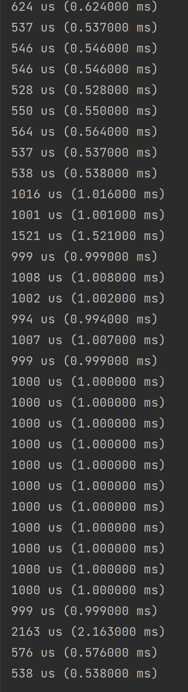

## 项目介绍
（本人也属于是cpp初学者，各种语言也都会一点，写的不好还望指正）本项目是根据B站up的go手写BT下载器改编的cpp版本

原项目地址：[go-torrent](https://github.com/archeryue/go-torrent)

原项目视频介绍：[视频链接](https://www.bilibili.com/video/BV1zZ4y1678G/)

源码在src目录

debian-iso.tt和debian-iso(1).tt是用于测试解析情况的torrent文件
### 目前的Parse解析性能对比(Parse文件解析再写入操作)
>cpp version:(release版本)
> 

> go version
> 

就速度测试过程而言，go语言编译+运行非常的快，我cpp编译还要好一会儿。。。
最终的运行速度，go语言稍逊一筹，但我认为主要原因可能是在gc上面，使得运算过程时快时慢，不太稳定。

最终的内存占用，毫无疑问，cpp肯定会更多，因为我使用的结构比较占内存😂
## 项目实现愿景
1. Bencode库实现 (✓)
2. Torrent文件解析 ()
3. ...