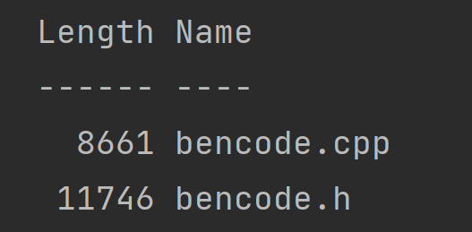

## 项目介绍
（本人也属于是cpp初学者，各种语言也都会一点，写的不好还望指正）本项目是根据B站up的go手写BT下载器改编的cpp版本

原项目地址：[go-torrent](https://github.com/archeryue/go-torrent)

原项目视频介绍：[视频链接](https://www.bilibili.com/video/BV1zZ4y1678G/)

debian-iso.tt和debian-iso(1).tt是用于测试解析情况的torrent文件

**源码在src目录**
### 构建方式
使用方式很简单，我就不自己提供cmake文件来构建了，因为这个bencode的解析文件代码仅仅只包含两个文件，只要把这两个文件放到您的项目即可使用：



### 使用教程
对于类似于反射的直接的ORM过程，我这里用的是C++的编译期模板+你提供的序列化函数。
这里有参考 json for Morden C++ 的实现方式，需要你自定义from_bencode和to_bencode函数。
使用例子如下：

每个对象都是一个Dict，需要对每个字段取不同的名称。
```cpp
#include <iostream>
#include <sstream>
#include "bencode.h"
//test custom type
struct Student {
    int id;
    std::string name;
    std::vector<std::string> ip;
    std::unordered_map<std::string, int> mapping;
};

using namespace bencode;

void to_bencode(Bencode &obj, Student &student) {
    obj["id"] = student.id;
    obj["name"] = student.name;
    obj["ip"] = student.ip;
    obj["mapping"] = student.mapping;
}

void from_bencode(Bencode &obj, Student &student) {
    student.id = obj["id"].get<int>();
    student.name = obj["name"].get<std::string>();
    student.ip = obj["ip"].get<std::vector<std::string>>();
    student.mapping = obj["mapping"].get<std::unordered_map<std::string, int>>();
}

void printStudent(Student const &student) {
    std::cout << student.name << '\n';
    std::cout << student.id << '\n';
    for (const auto &item: student.ip) {
        std::cout << item << "  ";
    }
    std::cout << '\n';
    for (auto &&[k, v]: student.mapping) {
        std::cout << "k:" << k << "  " << "v:" << v << '\n';
    }
}

int main() {
    std::stringstream ss;
    Student student{
        .id = 2002,
        .name = "刘xx",
        .ip = {
          "2329323",
          "3432424",
          "23434322"
        },
        .mapping = {
                {"test",283},
                {"testname",3232}
        }
    };
    Bencode b;
    b<<student;
    ss<<b;
    std::cout<<ss.str()<<std::endl;
    Student tmp;
    b>>tmp;
    printStudent(tmp);
}
```
### 目前的Parse解析性能对比(Parse文件解析再写入操作)
>cpp version:(release版本)
> 

> go version
> 

就速度测试过程而言，go语言编译+运行非常的快，我cpp编译还要好一会儿。。。
最终的运行速度，go语言稍逊一筹，但我认为主要原因可能是在gc上面，使得运算过程时快时慢，不太稳定。

最终的内存占用，毫无疑问，cpp肯定会更多，因为我使用的结构比较占内存😂
## 项目实现愿景
1. Bencode库实现 (✓)
2. Torrent文件解析 (✓)
3. ...